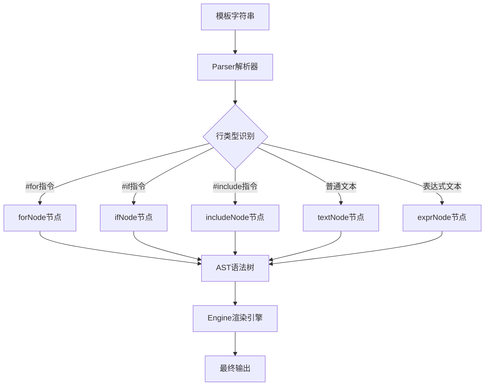

# YAML注释与模板指令兼容性测试设计

## 1. 概述

本设计文档旨在为HashTemplate模板引擎创建全面的测试用例，确保YAML文件中的`#`注释与模板引擎的`#for`、`#if`等指令能够正确共存，不会产生解析冲突或功能异常。

### 1.1 问题描述

在YAML文件中，`#`字符用于标记注释行，而HashTemplate模板引擎同样使用`#`作为指令前缀（如`#for`、`#if`、`#end`等）。需要验证：

1. YAML注释是否会被误解析为模板指令
2. 模板指令与YAML注释混合使用时的解析准确性
3. 各种边界情况下的兼容性

### 1.2 技术背景

- **项目类型**: Go语言后端模板引擎库
- **核心功能**: 模板解析与渲染
- **语法特性**: `${}`表达式、`#for`循环、`#if`条件、`#include`包含
- **目标场景**: Kubernetes YAML配置文件生成

## 2. 架构分析

### 2.1 解析器架构



### 2.2 关键组件交互

| 组件      | 职责        | 与注释相关的处理         |
| --------- | ----------- | ------------------------ |
| parser.go | 模板解析    | 通过正则表达式识别指令行 |
| nodes.go  | AST节点定义 | 各类节点的渲染逻辑       |
| engine.go | 渲染引擎    | 执行节点渲染和上下文管理 |

### 2.3 指令识别机制

当前解析器使用以下正则表达式识别指令：
- `#if` 条件指令
- `#for` 循环指令  
- `#include` 包含指令
- `#end` 结束标记

## 3. 测试策略

### 3.1 测试分类

#### 3.1.1 基础兼容性测试
- YAML标准注释与模板指令并存
- 不同缩进级别的注释处理
- 行内注释与模板表达式组合

#### 3.1.2 边界情况测试
- 注释中包含类似指令的文本
- 多行注释块处理
- 空行和空白字符处理

#### 3.1.3 实际场景测试
- Kubernetes YAML完整配置
- Docker Compose文件模板
- 应用配置文件模板

### 3.2 测试数据设计

#### 3.2.1 基础测试用例

```yaml
# 基础YAML注释测试
apiVersion: apps/v1  # API版本注释
kind: Deployment
metadata:
  name: ${appName}
  # 命名空间配置
  namespace: ${namespace ?? "default"}
spec:
  # 副本数量配置
  replicas: ${replicas}
  template:
    spec:
      containers:
        #for c in containers  # 循环遍历容器
        - name: ${c.name}
          # 容器镜像配置
          image: ${c.image}:${c.tag ?? "latest"}
          ports:
            #for p in c.ports  # 端口配置循环
            - containerPort: ${p}  # 容器端口
            #end
        #end
```

#### 3.2.2 复杂混合场景

```yaml
# 多层嵌套注释与指令混合
#if enableServices  # 条件：启用服务
---
# Service配置段落
apiVersion: v1
kind: Service
metadata:
  # 服务名称注释
  name: ${serviceName}
  # 标签配置
  labels:
    #for key, value in serviceLabels
    ${key}: ${value}  # 动态标签
    #end
spec:
  # 端口映射
  ports:
    #for port in servicePorts
    # 端口 ${port.name} 配置
    - name: ${port.name}
      port: ${port.port}
      targetPort: ${port.targetPort ?? port.port}
    #end
#end  # 服务配置结束
```

### 3.3 测试用例结构

#### 3.3.1 测试文件组织

```
yaml_comment_test.go
├── TestYAMLCommentBasic()        # 基础注释兼容性
├── TestYAMLCommentWithDirectives() # 指令与注释混合
├── TestYAMLCommentEdgeCases()    # 边界情况
├── TestYAMLCommentKubernetes()   # Kubernetes实际场景
└── TestYAMLCommentPerformance()  # 性能基准测试
```

#### 3.3.2 测试断言策略

```go
type yamlCommentTest struct {
    name        string                 // 测试用例名称
    template    string                // 模板内容
    context     map[string]interface{} // 渲染上下文
    expected    string                // 期望输出
    shouldError bool                  // 是否应该出错
    assertions  []string              // 额外断言检查
}
```

## 4. 预期测试结果

### 4.1 正确行为验证

1. **注释保留**: YAML标准注释应在输出中完整保留
2. **指令执行**: 模板指令应正常解析和执行
3. **格式维护**: 输出YAML格式应保持有效性
4. **性能稳定**: 混合使用不应显著影响渲染性能

### 4.2 错误情况处理

1. **解析错误**: 应准确报告模板语法错误
2. **运行时错误**: 应妥善处理上下文数据缺失
3. **格式错误**: 应识别无效的YAML结构

## 5. 测试实现要点

### 5.1 关键测试场景

#### 5.1.1 注释位置变化
- 行首注释
- 行尾注释  
- 多级缩进注释
- 嵌套结构中的注释

#### 5.1.2 指令识别准确性
- 注释中的伪指令文本
- 指令前后的注释
- 条件和循环的嵌套注释

#### 5.1.3 实际应用验证
- 完整Kubernetes Deployment
- 多资源YAML文档
- 复杂配置文件模板

### 5.2 性能考量

#### 5.2.1 基准测试指标
- 解析时间对比
- 内存使用分析
- 大文件处理能力

#### 5.2.2 优化验证
- 缓存机制有效性
- 并发安全性
- 资源回收正确性

## 6. 测试覆盖率目标

### 6.1 功能覆盖
- [ ] 基础YAML注释处理 (100%)
- [ ] 模板指令执行 (100%)
- [ ] 混合场景兼容性 (95%)
- [ ] 边界情况处理 (90%)

### 6.2 代码覆盖
- [ ] parser.go注释相关逻辑
- [ ] nodes.go渲染相关代码
- [ ] engine.go核心引擎逻辑

## 7. 风险评估

### 7.1 技术风险
- **正则表达式冲突**: 指令识别可能误匹配注释内容
- **解析歧义**: 复杂嵌套场景的解析准确性
- **性能影响**: 大量注释对解析性能的影响

### 7.2 缓解策略
- 精确的正则表达式设计
- 分层解析机制
- 性能基准测试验证
